# React Alicante Workshop — Attendee Setup

It takes about half an hour, most of it waiting for installs and account
confirmations.

You will create four accounts as you go: GitHub and Claude in step 1, Supabase
in step 3, and Vercel in step 5. Docker and the Vercel CLI are not needed.

1. [Install the tools](#1-install-the-tools)
2. [Fork and clone](#2-fork-and-clone)
3. [Set up Supabase](#3-set-up-supabase)
4. [Run it locally](#4-run-it-locally)
5. [Deploy to Vercel](#5-deploy-to-vercel)
6. [Check both environments](#6-check-both-environments)
7. [Create your workshop tickets](#7-create-your-workshop-tickets)

## 1. Install the tools

### Node.js 22.13 or newer

```bash
node -v   # v22.13.0 or higher is fine
```

Not installed, or a lower version? Install the LTS version:

1. Download the **LTS** installer from [nodejs.org](https://nodejs.org).
2. Run it and accept the defaults.
3. Open a new terminal and run `node -v` again.

Tested on Node 22 and 24. If you get errors, use Node 24 LTS.

### Git

```bash
git --version   # any version is fine
```

Not installed? Install it, then open a new terminal and run `git --version`:

- macOS: run `xcode-select --install` and click **Install**.
- Windows: download from [git-scm.com/download/win](https://git-scm.com/download/win) and accept the defaults.
- Linux: [git-scm.com/downloads](https://git-scm.com/downloads).

### Google Chrome

Download it from [google.com/chrome](https://www.google.com/chrome/).

### pnpm

```bash
npm install -g pnpm
pnpm -v   # prints a version number, e.g. 11.25.0
```

### GitHub CLI

You need a GitHub account: sign up at [github.com/signup](https://github.com/signup).

```bash
brew install gh                   # macOS
winget install --id GitHub.cli    # Windows (Linux: cli.github.com)
```

Check if you are already logged in:

```bash
gh auth status   # "Logged in to github.com" means you are done
```

If not, run `gh auth login`. It asks a few questions. Use the arrow keys and
press Enter to answer:

1. Account: **GitHub.com**
2. Protocol: **HTTPS**
3. How to authenticate: **Login with a web browser**

For any other question, press Enter to accept the default.

The terminal then shows a one-time code. Copy it and press Enter. Your browser
opens and asks for that code: paste it and authorise. Then run `gh auth status`
again.

### Claude Code

You need a paid Claude plan first. Pro is the minimum:
[claude.com/pricing](https://claude.com/pricing). The free plan doesn't include
Claude Code.

**Option 1 (recommended):**

```bash
curl -fsSL https://claude.ai/install.sh | bash   # macOS, Linux, WSL
irm https://claude.ai/install.ps1 | iex          # Windows PowerShell
```

**Option 2:** with npm, on any system:

```bash
npm install -g @anthropic-ai/claude-code
```

Check:

```bash
claude --version   # prints a version number
```

### Browser for Playwright

Claude tests the app in a browser with the Playwright tools, which the repo
already configures. The download is about 700 MB.

```bash
npx playwright install chromium
```

## 2. Fork and clone

Open a terminal in the folder where you keep your projects. Then fork and clone
in one command:

```bash
gh repo fork engineering-workshops/react-alicante-agentic-workflow --clone
```

Or click **Fork** on
[github.com/engineering-workshops/react-alicante-agentic-workflow](https://github.com/engineering-workshops/react-alicante-agentic-workflow).
Untick **Copy the `dev` branch only**, so your fork also gets the `main`
branch. Then clone your fork:

```bash
git clone https://github.com/<your-username>/react-alicante-agentic-workflow.git
```

Then, inside the folder, install the project's dependencies. This also installs
the Supabase CLI, so you do not need a separate install:

```bash
cd react-alicante-agentic-workflow
pnpm install
```

Then start Claude Code once. Log in, approve the Playwright server, then exit:

```bash
claude
```

Check:

```bash
git remote get-url origin   # prints your fork's URL
```

The URL has your GitHub username in it, not `engineering-workshops`. Then check
that you have the `main` branch:

```bash
git branch -r   # the list includes origin/main
```

## 3. Set up Supabase

### Create an account

You will create a new Supabase account with an alias of your email. Everyone
does this, so every account has two free project slots for the two databases:
QA and Production.

1. Make your alias. An alias is a second address that delivers to your normal
   inbox. Add `+alicante` before the `@`: `example@gmail.com` becomes
   `example+alicante@gmail.com`.
2. Go to [supabase.com/dashboard/sign-up](https://supabase.com/dashboard/sign-up).
3. Sign up with the alias and a password. Don't use "Continue with GitHub".
4. Confirm your email.

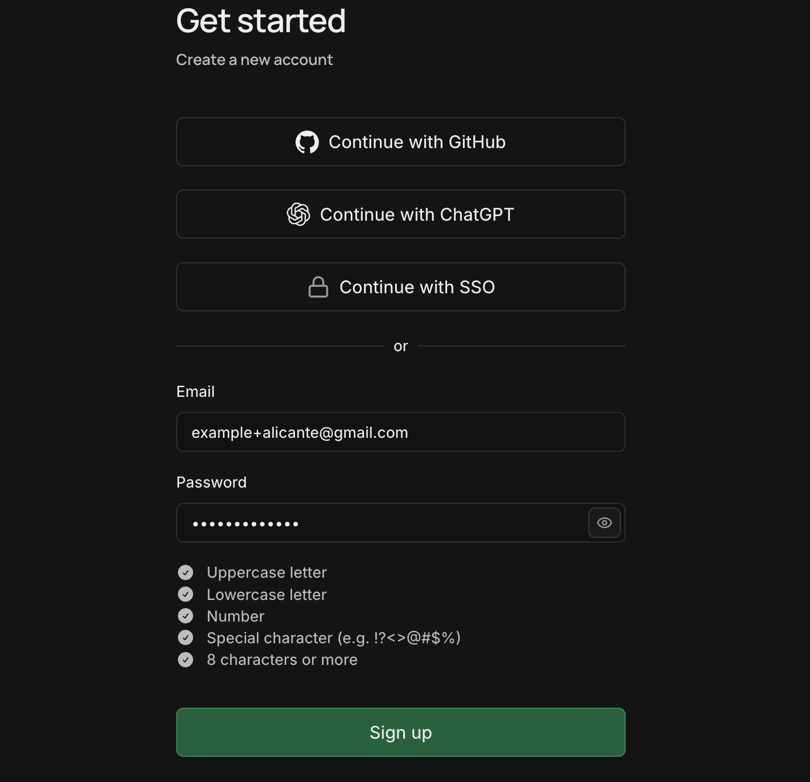

### Create an organization

Go to [supabase.com/dashboard/new](https://supabase.com/dashboard/new) and fill
in the form:

- **Name:** `React-Alicante-Workshop` (any name works)
- **Type:** Educational
- **Plan:** Free - $0/month

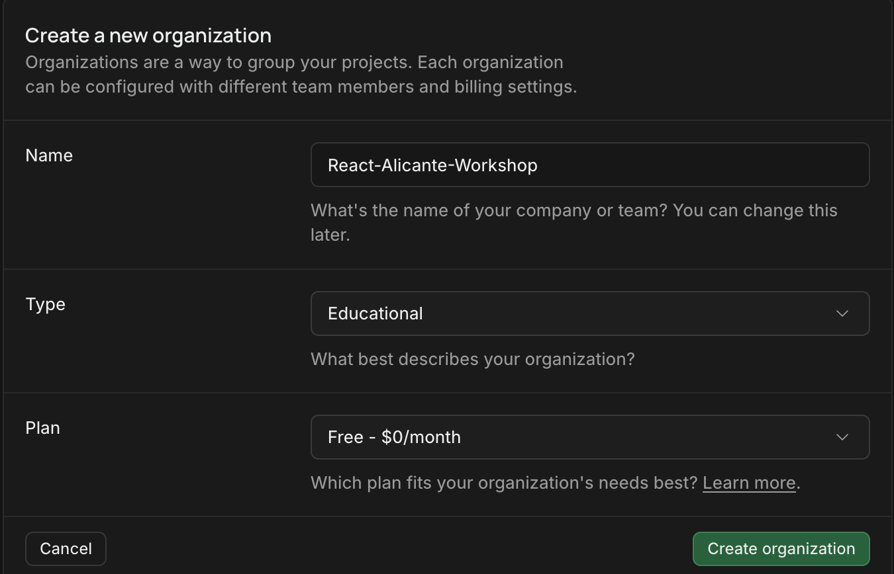

### Create the QA project: `ra-qa`

You create two projects: one for development (QA) and one for your deployed
site (Production). Start with QA.

1. Open [supabase.com/dashboard/projects](https://supabase.com/dashboard/projects)
   and click **New project**.
2. Name it `ra-qa`. Click **Generate a password**, copy it, and save it in a
   secure note or a text document, with the project name next to it. It does
   not go in `.env.local`.
3. Leave the other options, including **Security**, as they are.

   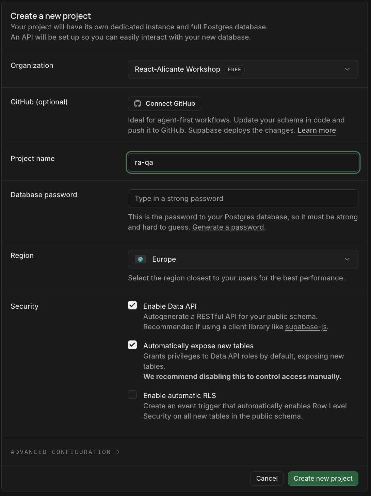

4. Click **Create new project**. When it is ready, open **Settings → General**.
   The **Project ID** is the **QA project ref**. Click **Copy** and save it in
   your note as `qa ref`, next to the password.

   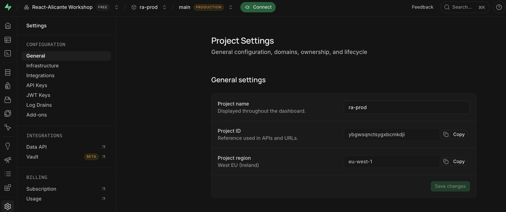

### Create the Production project: `ra-prod`

Repeat the same steps:

1. Click **New project** and name it `ra-prod`.
2. Generate a new password and save it in your note.
3. Leave the other options as they are.
4. Click **Create new project**. Open **Settings → General**. The **Project
   ID** is the **Production project ref**. Copy it and save it in your note as
   `prod ref`.

### Wire up environment variables

Create your env file and open it in your editor:

```bash
cp .env.example .env.local
```

Replace everything in it with this, using your own values:

```dotenv
NEXT_PUBLIC_SUPABASE_URL=https://abcdefghijklmnopqrst.supabase.co
NEXT_PUBLIC_SUPABASE_PUBLISHABLE_KEY=sb_publishable_AbCdEfGhIjKlMnOpQrSt
SUPABASE_PRODUCTION_PROJECT_REF=uvwxyzabcdefghijklmn
NEWS_API_URL=https://hn.algolia.com/api/v1
NEXT_PUBLIC_ENABLE_STATS=true
```

**`NEXT_PUBLIC_SUPABASE_URL`**: open `ra-qa` → **Integrations → Data API** and
copy the API URL. Remove the ending `/rest/v1/`.

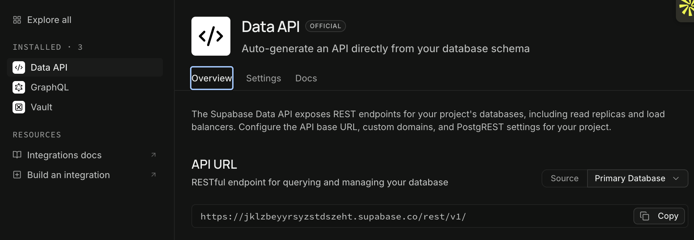

**`NEXT_PUBLIC_SUPABASE_PUBLISHABLE_KEY`**: open `ra-qa` → **Settings → API
Keys** and copy the `default` publishable key. Use the copy icon: the text on the
page is cut off.

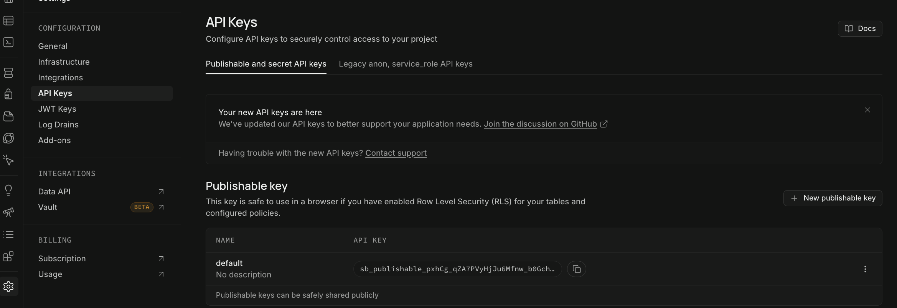

**`SUPABASE_PRODUCTION_PROJECT_REF`**: the `prod ref` from your note. To find it
again, open `ra-prod` → **Settings → General** and copy the **Project ID**.

Check: the ref in `NEXT_PUBLIC_SUPABASE_URL` is the Project ID of `ra-qa`, not
`ra-prod`. Mixing them up is the most common mistake.

### Connect and create the tables

The app shows a conference schedule. The schedule is stored in a database table
called `sessions`. The repo has files, called migrations, that create and fill
that table. You apply them to your QA project in five steps:

1. Log in to Supabase:

   ```bash
   pnpm supabase login
   ```

   A browser window opens and shows a verification code. Click **Copy code**.

   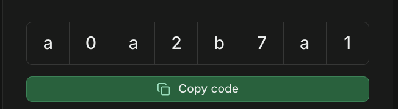

   Paste it in the terminal where it says "Enter your verification code", and
   press Enter.

   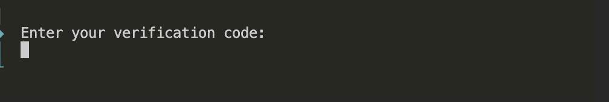

   Before you log in, keep only one browser open: the one where you are logged
   in to the Supabase account you just created. The login opens in it. If another
   account opens, run `pnpm supabase logout` and log in again.

   Check that you are logged in. This lists your projects, and you see `ra-qa`
   and `ra-prod`:

   ```bash
   pnpm db:link:status
   ```

2. Link the repo to `ra-qa`. Use the `qa ref` from your note. It asks for the
   `ra-qa` database password from your note:

   ```bash
   pnpm supabase link --project-ref <qa-ref>
   ```

   Check that the link worked. Run `pnpm db:link:status` again: the `●` in the
   first column must be on the `ra-qa` row.

3. Preview what will be created. Nothing changes yet:

   ```bash
   pnpm db:push:dry-run
   ```

   It lists the migrations that will be applied.

4. Create and fill the tables. It asks you to confirm:

   ```bash
   pnpm db:push
   ```

5. Generate the TypeScript types from your database:

   ```bash
   pnpm db:types
   ```

Check: in Supabase, open `ra-qa` → **Table Editor** → **sessions**. It shows 8
rows.

**`db push` can't connect?** Some networks are IPv4 only, and the direct
connection needs IPv6. Use the Session pooler instead:

1. In `ra-qa`, click **Connect**, open the **Direct** tab, and under
   **Connection Method** choose **Session pooler**. Keep the type **URI** and
   copy the connection string below it.

   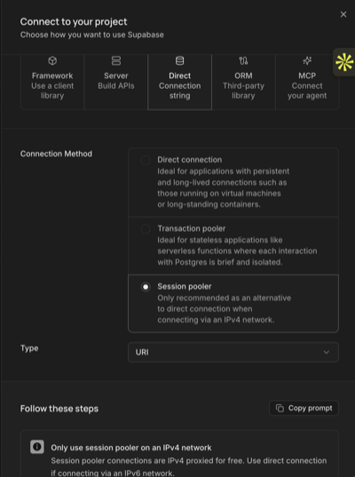

2. Replace `[YOUR-PASSWORD]` in it with your DB password.
3. Run:

   ```bash
   pnpm supabase db push --db-url "<connection-string>"
   ```

## 4. Run it locally

```bash
pnpm dev
```

Open `localhost:3000/en/sessions`.

Check: the schedule shows up, so Supabase is connected. Then stop the server
with `Ctrl+C`.

**"Invalid API key"?** The key is incomplete or from another project. Copy it
again with the copy icon, not by selecting the text.

**"Could not find the table"?** The ref in `NEXT_PUBLIC_SUPABASE_URL` is not the
Project ID of `ra-qa`. Fix it.

After you change `.env.local`, stop the server with `Ctrl+C` and run `pnpm dev`
again. It only reads the file when it starts.

## 5. Deploy to Vercel

1. Create a Vercel account at [vercel.com/signup](https://vercel.com/signup), if
   you don't have one. Signing up with GitHub is the fastest.
2. Go to [vercel.com/new](https://vercel.com/new). Choose the GitHub account that
   owns your fork, find your fork, and click **Import**.

   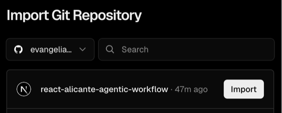

   **Fork missing?** Vercel may not have access to it yet. Below the list, click
   **Adjust GitHub App Permissions**:

   

   On the GitHub page, click **Configure** next to your account:

   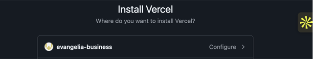

   Under **Repository access**, add your fork (or choose **All repositories**)
   and save. Then reload the Vercel page. Your fork now shows in the list, as in
   the first picture.

   After you click **Import**, you see the **New Project** page. Leave the
   settings as they are. The name is yours to choose.

   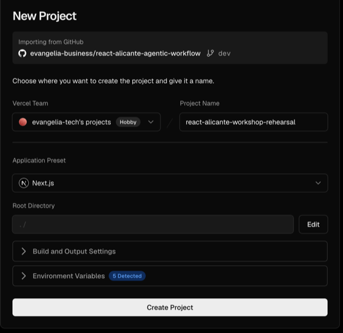

3. Open **Environment Variables**. Vercel found the names from `.env.example`.
   Each one has a **Value** and an **Environments** dropdown.

   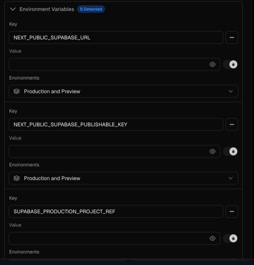

   The same variable can have a different value in Production and in Preview:
   Preview uses `ra-qa`, Production uses `ra-prod`.

   | Variable                               | Preview                 | Production                                     |
   | -------------------------------------- | ----------------------- | ---------------------------------------------- |
   | `NEXT_PUBLIC_SUPABASE_URL`             | same as in `.env.local` | `https://<prod ref>.supabase.co`               |
   | `NEXT_PUBLIC_SUPABASE_PUBLISHABLE_KEY` | same as in `.env.local` | `ra-prod` → **Settings → API Keys**, copy icon |
   | `NEWS_API_URL`                         | same in both            | same in both                                   |
   | `NEXT_PUBLIC_ENABLE_STATS`             | `true`                  | `false`                                        |
   - **Same value in both** (`NEWS_API_URL`): keep **Production and Preview**.
   - **Different values** (the URL, the key and the stats flag): add each variable
     twice. Set the first one to **Production** only, with the `ra-prod` value.
     Add it again, set to **Preview** only, with the `ra-qa` value.
   - `SUPABASE_PRODUCTION_PROJECT_REF`: not needed in Vercel. Remove it with the
     minus button.

4. Click **Create Project**, the button at the bottom of the New Project page.
   This creates the project, but nothing is deployed yet.

Check: the project **Overview** says **No Production Deployment**. That is
expected: your first push deploys it.

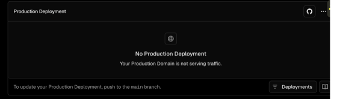

Then check the Production branch. Open **Settings → Environments**.
**Production** must track `main`. `dev` and feature branches get Preview
deployments.

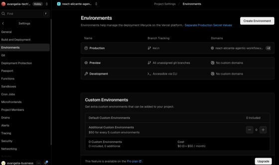

If Production says `dev`, click **Production**, change **Branch Tracking** to
`main`, and click **Save**.

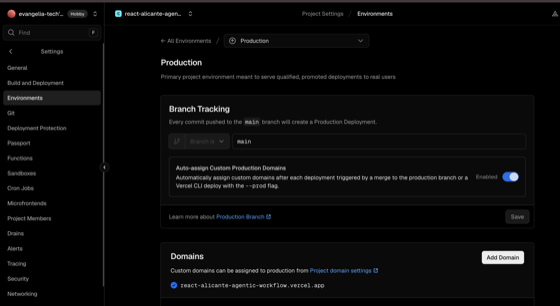

## 6. Check both environments

The first deployment of a new Vercel project is always a **Production**
deployment, from whatever branch you push. The next ones are Previews.

**Production:** push an empty commit to `dev`:

```bash
git commit --allow-empty -m "Trigger a preview"
git push origin dev
```

In Vercel → **Deployments**, the new row has the **Production** badge. When it
shows **Ready**, open the project **Overview** and click **Visit**. The
site loads. `/en/sessions` is empty for now, because `ra-prod` has no tables
yet.

**Preview (QA):** push a second empty commit:

```bash
git commit --allow-empty -m "Trigger a second preview"
git push origin dev
```

This row has the **Preview** badge, because Production now exists:

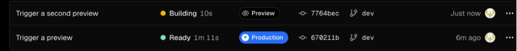

When it shows **Ready**, click it, then click **Visit**. The preview URL is under
**Domains**.

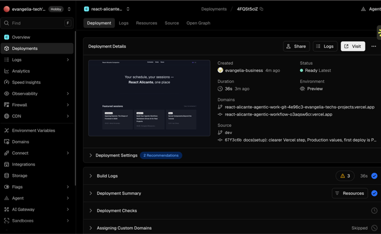

Check: its `/en/sessions` shows the schedule from `ra-qa`.

## 7. Create your workshop tickets

The workshop tickets are files in the repo. Run this command in your fork's
folder to create them as GitHub issues, so the agent can read them:

```bash
pnpm workshop:tickets
```

It turns Issues on for your fork. It is safe to run twice: tickets that already
exist are skipped.

Check: your fork's **Issues** tab shows 3 open issues: a Speakers page, the
session level, and a Like button.

## Next

Setup is done. In the workshop you continue with the
[feature-builder walkthrough](feature-builder-walkthrough.md), then the
[release-manager walkthrough](release-manager-walkthrough.md).
