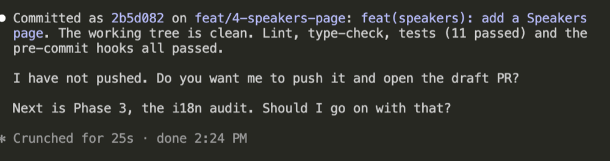
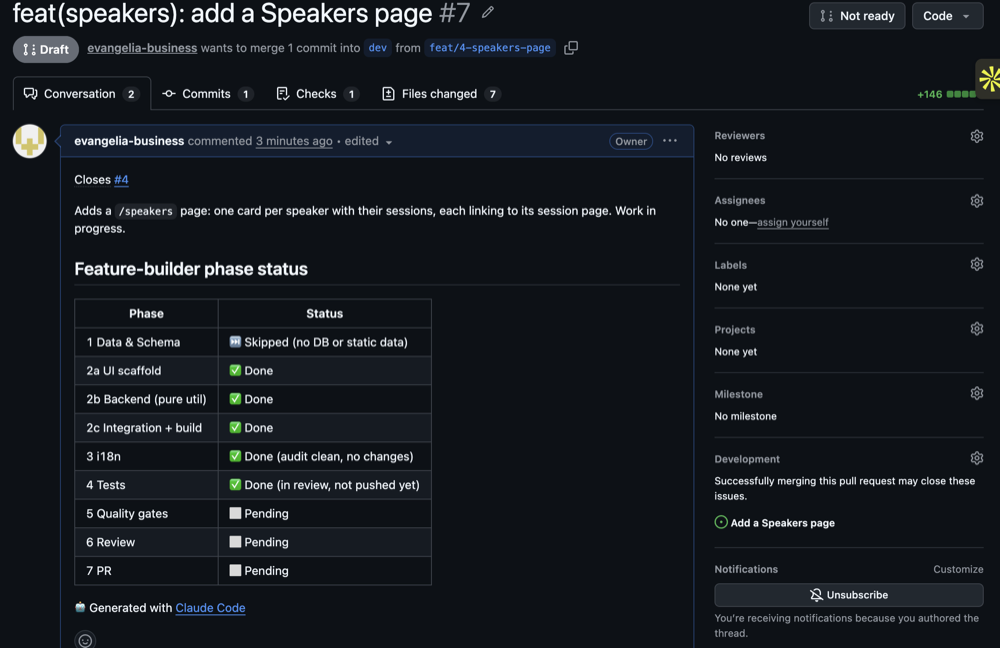
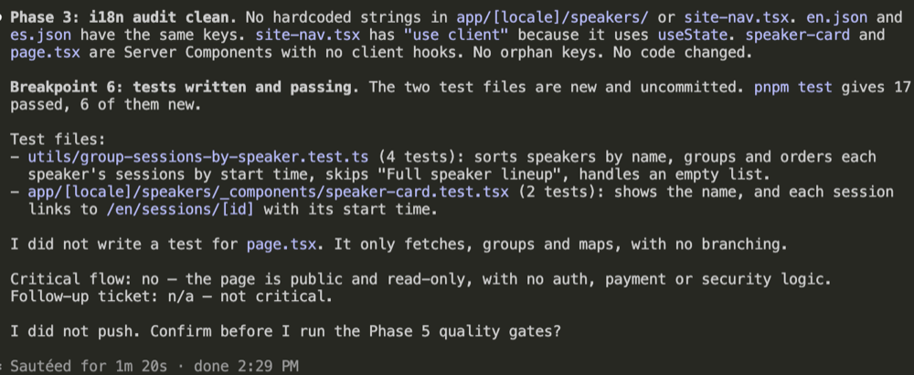
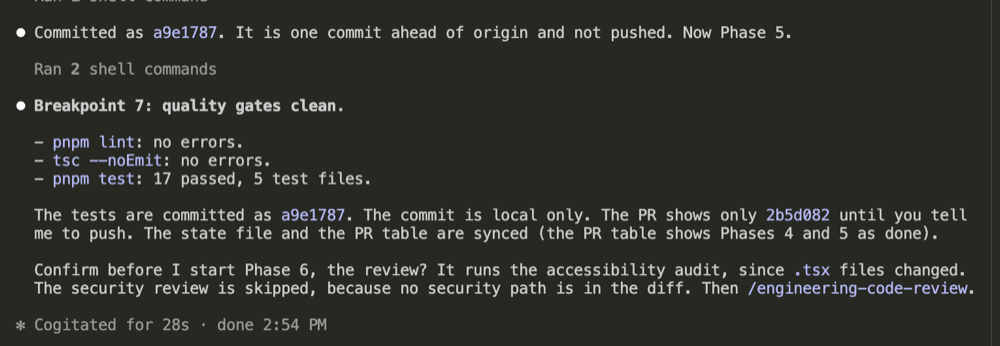
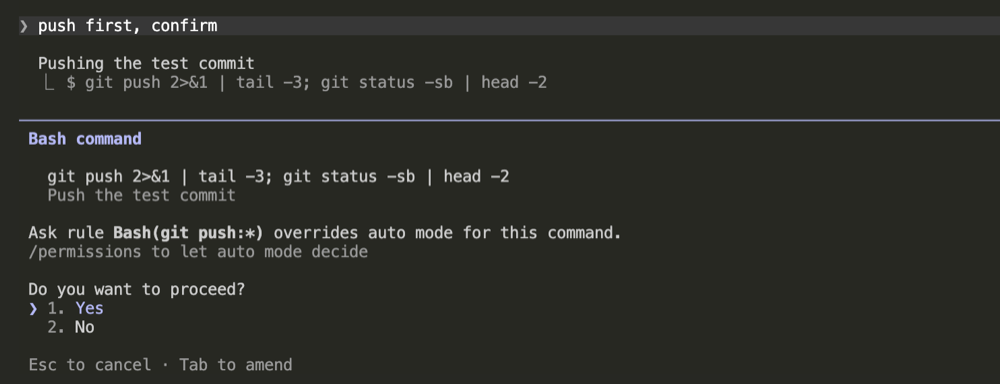

# Feature-builder walkthrough

Draft. The steps are written after the rehearsal.

Goal: build tickets 1 and 2 with the `feature-builder` agent. Ticket 3 is
optional, if there is time.

## Before you start

Stop any dev server that is still running, including old ones you forgot. The
agent starts its own, and two servers can clash on the same port.

- Press `Ctrl+C` in the terminal where `pnpm dev` runs.
- Still running? Stop all Node programs (macOS and Linux). This also stops other
  Node programs you have open.

  ```bash
  killall -9 node
  ```

## Start

The first ticket is **Add a Speakers page**. Open a terminal in VS Code, not the
Claude chat. Check that you are on `dev` and that `git status` is clean. Then run
the agent from the repo root, with the ticket number in quotes:

```bash
claude --agent feature-builder "#1"
```

Use the number of that ticket in your fork's **Issues** tab. It is normally #1.

## Steps

The agent stops at each **Breakpoint**. Read the report, then answer.

1. Choose **Yes, I trust this folder**.

   

2. Choose **Use this MCP server**.

   

3. The agent creates a branch and a progress file. No answer needed.

   

4. Read the plan and type **confirm**. Ticket 1 is UI only, so the database
   phase is skipped.

   

5. Wait. The agent reads the code and creates the files.

   

   

6. **Breakpoint 3.** Type **confirm**. `/speakers` shows only the heading for now.

   

   

7. **Breakpoint 4.** Type **confirm**.

   

8. Wait. The agent wires the page and runs the build.

   

9. **Breakpoint 5.** Run `pnpm dev` again if the agent stopped it. Open
   `/speakers` and test the page.

   

   

10. The page works. Type **commit this**.

    

11. Answer **yes** to push and open a draft PR. Approve the push. Find the PR in
    the **Pull requests** tab.

    

12. **Breakpoint 6.** The agent wrote the tests. They are not committed yet.

    

13. Answer **yes** to commit the tests. **Breakpoint 7.** Type **push first,
    confirm**, so the review sees all changes.

    

14. Approve the push: **Yes**.

    

To do: the review (Phase 6) and the pull request.

## Merge the pull request

To do: merge with **Squash and merge**, then delete the branch.

## Repeat for ticket 2

```bash
claude --agent feature-builder "#2"
```

## Done

To do: what you should see when both tickets are merged into `dev`.
