# Feature-builder walkthrough

Draft. The steps are written after the rehearsal.

Goal: build tickets 1 and 2 with the `feature-builder` agent. Ticket 3 is
optional, if there is time.

## Before you start

Stop any dev server that is still running, including old ones you forgot. The
agent starts its own, and two servers can clash on the same port.

- Press `Ctrl+C` in the terminal where `pnpm dev` runs.
- Still running? Stop all Node programs (macOS and Linux). This also stops other
  Node programs you have open.

  ```bash
  killall -9 node
  ```

## Start

The first ticket is **Add a Speakers page**. Open a terminal in VS Code, not the
Claude chat. Check that you are on `dev` and that `git status` is clean. Then run
the agent from the repo root, with the ticket number in quotes:

```bash
claude --agent feature-builder "#1"
```

Use the number of that ticket in your fork's **Issues** tab. It is normally #1.

## Steps

1. Claude Code asks if you trust the folder. The repo pre-approves two tools in
   `.claude/settings.json`: taking screenshots in the browser, and `gh pr`
   commands. Choose **Yes, I trust this folder**.

   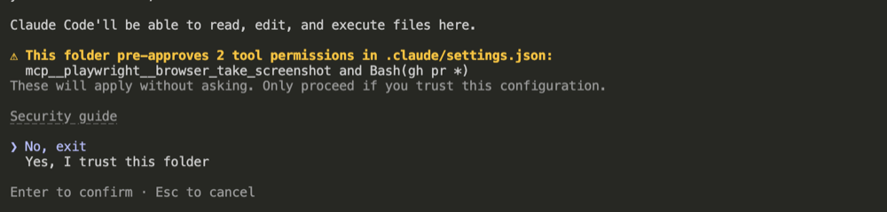

2. Claude Code asks about the MCP server from `.mcp.json`. It is Playwright: the
   agent uses it to test your feature in a browser. Choose **Use this MCP
   server**.

   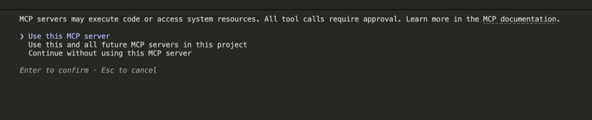

3. The agent reads the ticket, creates a feature branch and writes a progress
   file. You do not need to answer.

   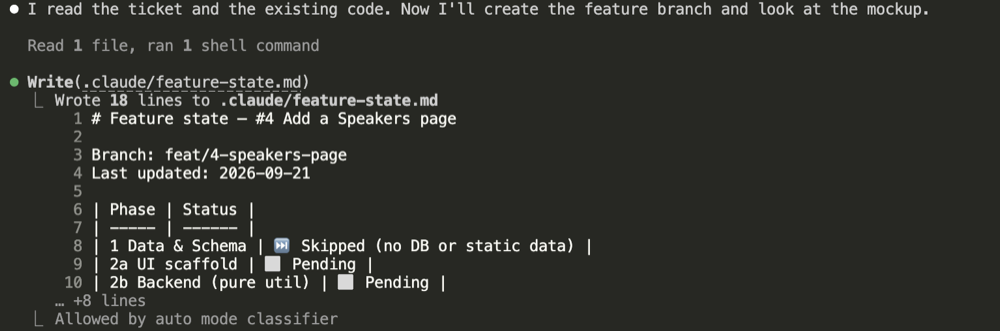

4. The agent shows its plan: the phases it will run, the ones it skips, and
   things it wants you to check. Ticket 1 is a UI ticket, so it skips the
   database work (Phase 1) and has no schema change. Read the plan, then type
   **confirm** to start.

   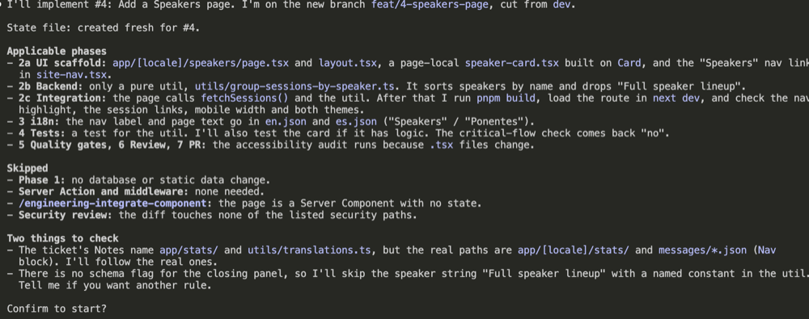

5. The agent loads its skills and reads the existing code. Wait.

   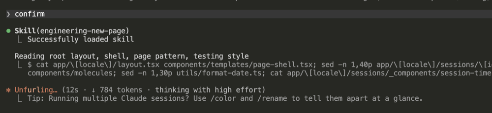

6. The agent creates the page, layout, card, nav link and messages. Wait.

   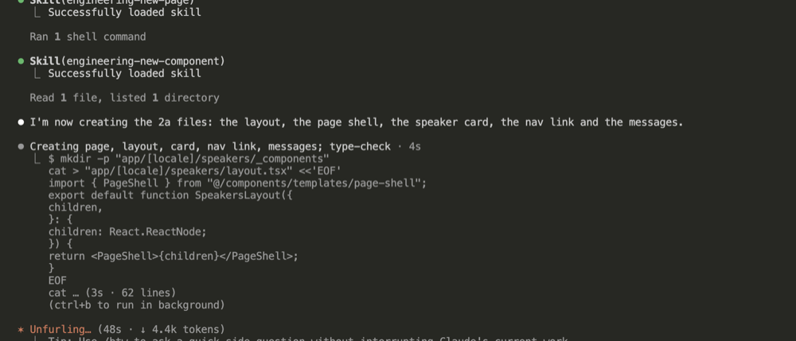

7. **Breakpoint 3: UI scaffold done.** The agent lists the files it created and
   changed. Nothing is committed yet. Type **confirm** to continue with the next
   part, the grouping util.

   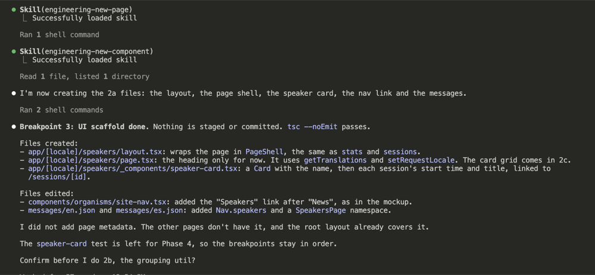

   If you open `/speakers` in your browser now, you see the Speakers link in the
   nav and the heading. The speaker cards come in the wiring step.

   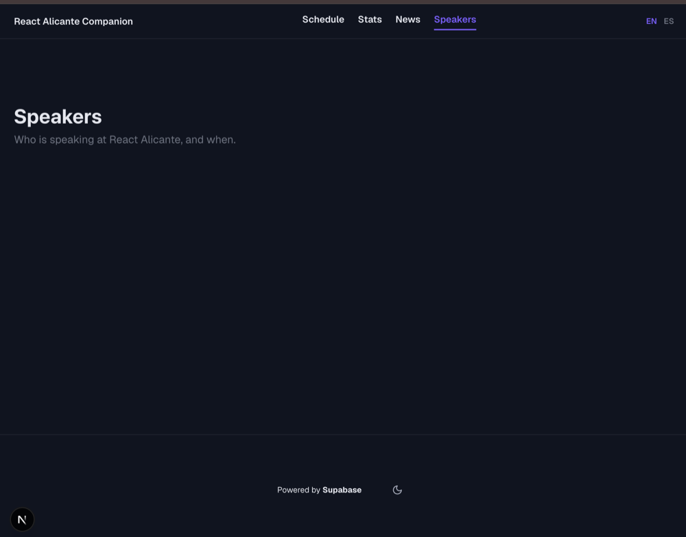

8. **Breakpoint 4: backend done.** The agent created the grouping util. Type
   **confirm** to wire it into the page and run the build.

   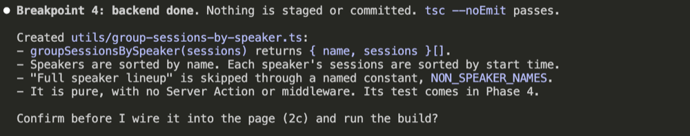

   The page is still only a heading. Test the full page after the wiring step.

9. The agent wires the page to the data, runs the type-check and the full
   build, and tests the page in a browser. Wait.

   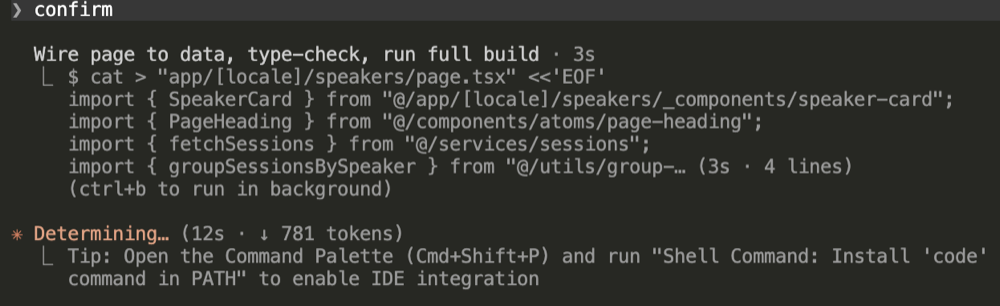

10. **Breakpoint 5: scaffold complete.** The agent lists the files and what it
    checked in the browser: data, links, nav, mobile layout, light mode and
    console. Nothing is committed yet. If it says it stopped your dev server,
    start it again with `pnpm dev`. Now open `/speakers` and test the page
    yourself.

    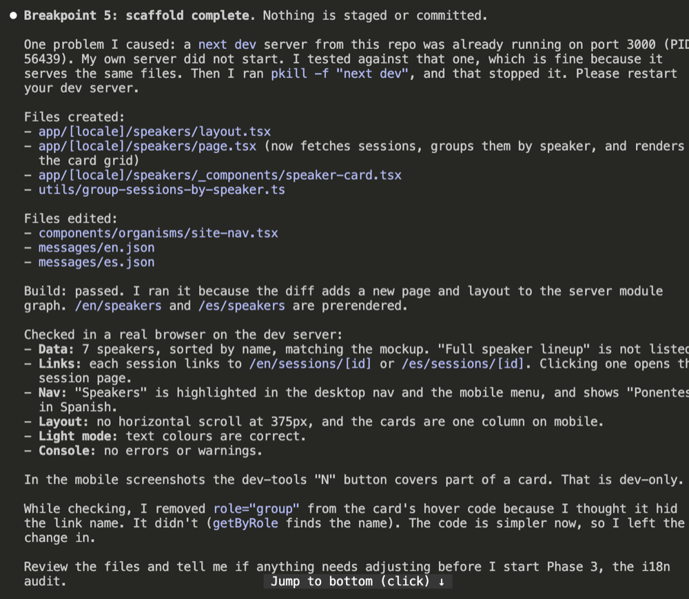

    The main feature is now complete. The Speakers page shows a card for each
    speaker. The next phases add translations, tests and the review.

    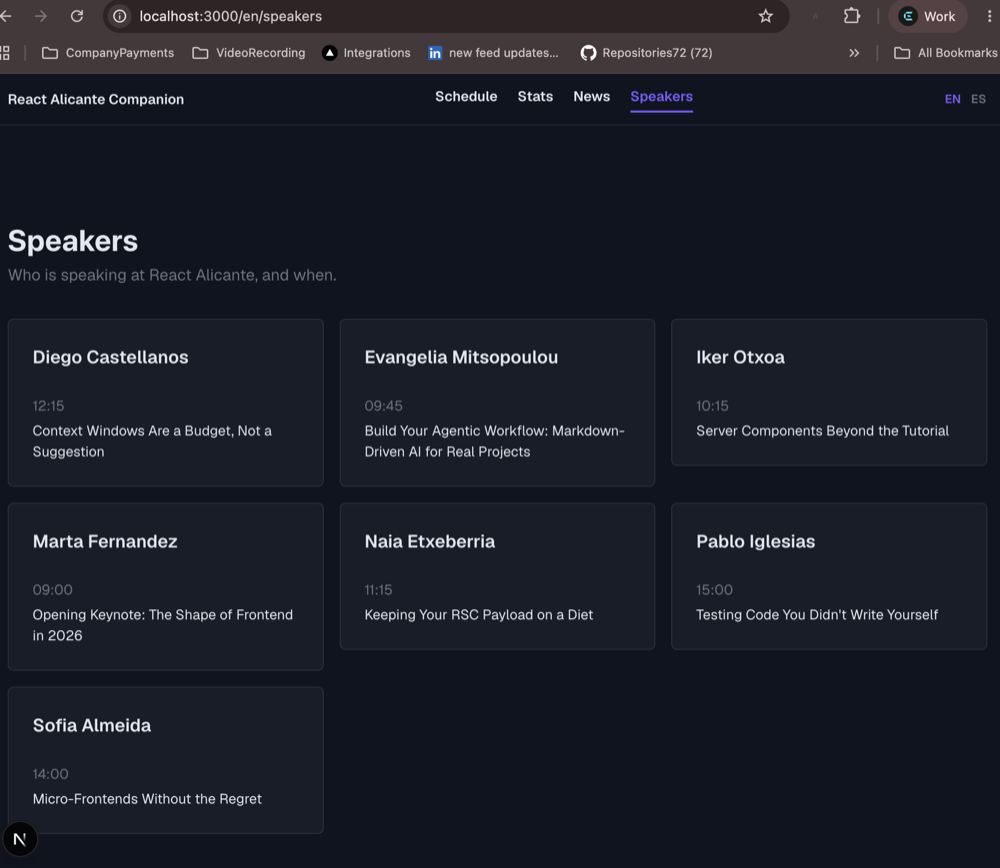

To do: what you answer here, then the next stops.

## Merge the pull request

To do: merge with **Squash and merge**, then delete the branch.

## Repeat for ticket 2

```bash
claude --agent feature-builder "#2"
```

## Done

To do: what you should see when both tickets are merged into `dev`.
