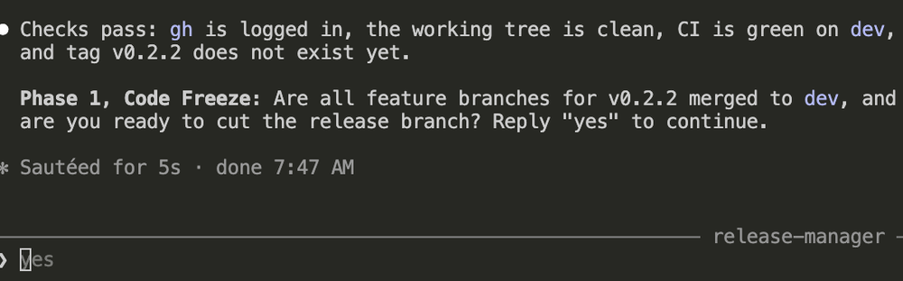

# Release-manager walkthrough

Draft. The steps are written after the rehearsal.

Goal: release tickets 1 and 2 to Production with the `release-manager` agent.
Both tickets must be merged into `dev` first.

## Start

Open a terminal in VS Code, not the Claude chat. Run it from the repo root:

```bash
claude --agent release-manager "next minor"
```

## Steps

The agent stops after each phase. Read the report, then answer.

1. Confirm the version. The agent shows the current version and the next one.
   Type **yes**.

   

2. **Phase 1, Code freeze.** The agent checks that `gh` is logged in, the
   working tree is clean and CI is green on `dev`. It asks if all tickets are
   merged into `dev`. Type **yes**.

   

3. The agent creates the release branch. It is not pushed yet. Type **yes** to
   go on to Phase 2.

   

4. **Phase 2, version and changelog.** The agent shows the version change in
   `package.json` and the commit. Type **yes** to confirm the write.

   

   

5. The agent shows a draft of the changelog. Type **yes** to write it. Then it
   reports two commits, not pushed yet. Type **yes** for Phase 3.

   

   

6. **Phase 3, release PR.** The agent asks to push the branch and create a label
   and the QA milestone. Choose **Yes**.

   

   It opens the release PR to `main`. Vercel is still building the preview, so
   do not test yet. Type **next**.

   

7. **Environment variables.** The agent compares `.env.example` with the code.
   Here there are no new variables, so there is nothing to add to Vercel.

   

   If there were new ones, the agent lists them. You add them in Vercel, under
   **Project → Settings → Environment Variables**, and then type **done**.

   

8. **Database health check.** The agent does not run database commands. Open a
   second terminal next to the Claude one, and run them yourself, from the repo
   root.

   

   

   1. `pnpm db:link:status`. The dot must be on `ra-qa`.

      

   2. `pnpm db:migrations:list`. The **Local** and **Remote** columns must be
      the same.

      

   3. In the Supabase dashboard, open the **SQL Editor** and run the two queries
      from the agent. Both must return no rows.

      

      

   Then tell the agent what you saw.

To do: the next phases, from the QA test to the tag.

## Merge the release pull request

To do: merge with **Create a merge commit**, not squash.

## Production database

To do: link to Production, run the dry run and the push, link back to QA.

## Done

To do: what you should see in Production and on GitHub.
